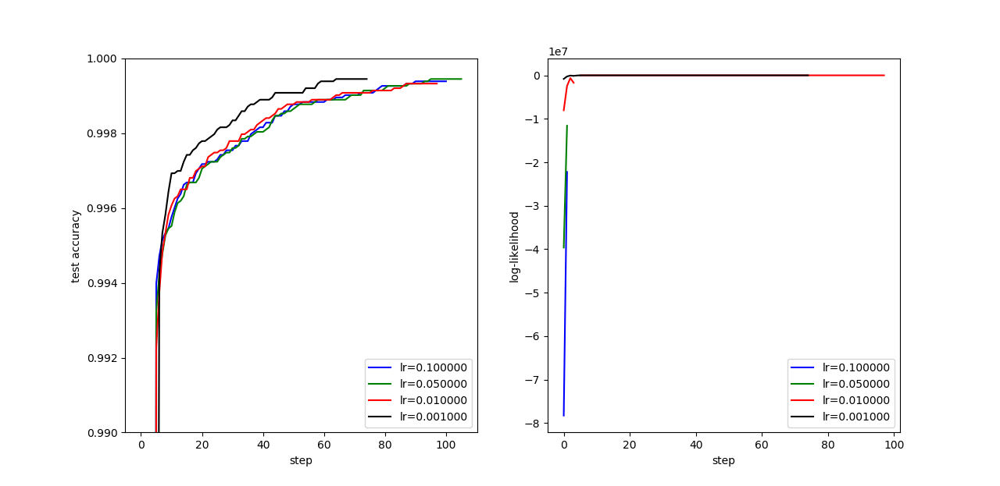

# Logistic Regression

## 数据

使用的数据集是UCI a9a。

Link: [http://ml.cs.tsinghua.edu.cn/~wenbo/data/a9a.zip](http://ml.cs.tsinghua.edu.cn/~wenbo/data/a9a.zip)

数据集分为训练集（32,561）和测试集（16,281），每一行的格式为

```txt
Label [feature id]:[feature] [feature id]:[feature] [feature id]:[feature] [feature id]:[feature]
```

其中默认只包含为1的列，feature总列数为123，如下例所示：

```txt
-1 3:1 11:1 14:1 19:1 39:1 42:1 55:1 64:1 67:1 73:1 75:1 76:1 80:1 83:1
-1 5:1 7:1 14:1 19:1 39:1 40:1 51:1 63:1 67:1 73:1 74:1 76:1 78:1 83:1
-1 3:1 6:1 17:1 22:1 36:1 41:1 53:1 64:1 67:1 73:1 74:1 76:1 80:1 83:1
...
```

`dataloader.py`包含了读取数据的`load(filename)`方法，可以读取一个这种格式的a9a数据文件。

## 梯度上升法

`gd.py`实现了梯度上升法求解Logistic Regression。

依赖库：

* `numpy`

代码文件的使用方法：

```bash
$ python gd.py -h
usage: gd.py [-h] [--data DATA] [--lr LR] [--patience PATIENCE]
             [--output OUTPUT]

Using gradient descent to solve logistic regression.

optional arguments:
  -h, --help           show this help message and exit
  --data DATA          Directory of the a9a data.
  --lr LR              Learning rate.
  --patience PATIENCE  Patience to stop.
  --output OUTPUT      Output log-likelihood and accuracy during training to
                       pickle file.
```

代码运行完成后，会输出一个pickle文件，包含训练过程中对数似然和测试集上正确率的变化，用于画图。

测试了`lr=0.001, 0.01, 0.05, 0.1`四种情况，最优正确率如下表：

| lr    | test acc |
| ----- | -------- |
| 0.001 | 0.999386 |
| 0.01  | 0.999447 |
| 0.05  | 0.999324 |
| 0.1   | 0.999447 |

四种学习率的测试集正确率和对数似然变化如下图：



可以看出：

* 四种学习率的最优正确率相似，但学习率越小，收敛越快
* 学习率越大，计算出的对数似然越小，以至于`lr=0.1, 0.05`时对数似然向下溢出了；这可能和`w`有多种表示相关

梯度上升法对`w`的初值不太敏感。

## IRLS法

`irls.py`实现了IRLS法求解Logistic Regression。

依赖库：

* `numpy`
* `sklearn`

代码文件的使用方法：

```bash
irls.py -h
usage: irls.py [-h] [--data DATA] [--lamb LAMB] [--cross]
               [--patience PATIENCE]

Using gradient descent to solve logistic regression.

optional arguments:
  -h, --help           show this help message and exit
  --data DATA          Directory of the a9a data.
  --lamb LAMB          Regularization constant.
  --cross              Do cross validation or not.
  --patience PATIENCE  Patience to stop.
```

在不使用10折验证时，代码的运行结果如下表（lambda是正则化常数）：

| lambda | step | train acc | test acc | w norm  |
| ------ | ---- | --------- | -------- | ------- |
| 0      | 11   | 1.0000    | 1.0000   | 34.7406 |
| 0.0001 | 11   | 1.0000    | 1.0000   | 30.5984 |
| 0.001  | 11   | 1.0000    | 1.0000   | 25.9729 |
| 0.01   | 11   | 1.0000    | 1.0000   | 20.9657 |
| 0.1    | 12   | 1.0000    | 1.0000   | 16.2047 |
| 1      | 12   | 0.9999    | 1.0000   | 11.8451 |

可以看出，在正则化常数不同时，模型在训练集和测试集上的准确率相差不大，只有`w`的值有所不同，正则化常数越大，`w`的L2-norm越小。

在使用10折验证时，代码的运行结果如下表：

| lambda | ave step | ave train acc | ave val acc | ave test acc | final test acc | final w norm |
| ------ | -------- | ------------- | ----------- | ------------ | -------------- | ------------ |
| 0      | 8.4 | 1.0000 | 1.0000 | 1.0000 | 1.0000 | 26.1409 |
| 0.0001 | 8.5 | 1.0000 | 1.0000 | 1.0000 | 1.0000 | 24.2089 |
| 0.001  | 7.3 | 1.0000 | 0.9999 | 1.0000 | 1.0000 | 20.0847 |
| 0.01   | 8.0 | 1.0000 | 1.0000 | 0.9999 | 1.0000 | 17.6599 |
| 0.1    | 6.5 | 1.0000 | 0.9998 | 1.0000 | 0.9999 | 13.8871 |
| 1      | 6.0 | 0.9999 | 0.9998 | 0.9999 | 0.9999 | 11.0648 |

可以看出，正则化常数越大，`w`的L2-norm越小，且收敛速度越快；其他准确率则没有明显差别。

值得注意的是：

* 在不加正则化项时，Hessian矩阵可能为奇异矩阵，需要用伪逆（`np.linalg.pinv`）。
* 牛顿法对`w`的初值敏感，如果设置得太大，会导致梯度失效。

虽然IRLS法所需的迭代次数较少，而且比较稳定（在`w`的初始值设置较好的前提下），但由于每次迭代都需要计算较大的矩阵乘法和求逆，因此整体效率比梯度上升法差。
